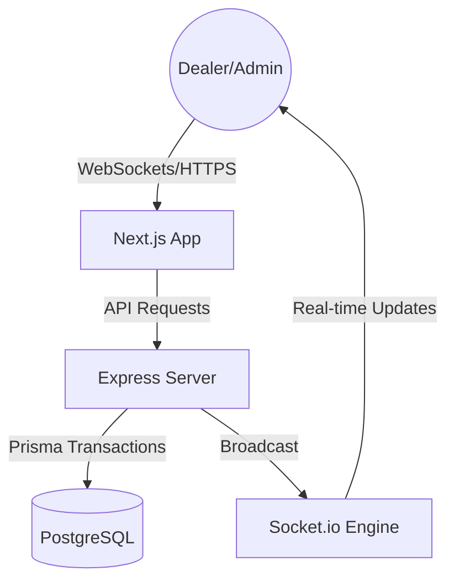

# 🚀 Regrip Real-Time Bidding System

A professional, high-concurrency real-time bidding environment designed for reliability and scale. Built with a modern full-stack architecture to handle high-frequency events and ensure data integrity.

### 🌐 Live Performance
- **Live Demo (Frontend)**: [https://regrip-frontend.netlify.app](https://regrip-frontend.netlify.app)
- **Live Server (Backend)**: [https://regrip-backend-u513.onrender.com](https://regrip-backend-u513.onrender.com)
- **Database**: Managed PostgreSQL on Neon.tech

---

## 🛠️ Tech Stack
| Layer | Technologies |
| :--- | :--- |
| **Frontend** | Next.js 14, Tailwind CSS, Lucide Icons, Zustand, Toaster |
| **Backend** | Node.js, Express, TypeScript, Socket.io |
| **Database** | PostgreSQL, Prisma ORM |
| **DevOps** | Docker, Docker Compose, GitHub Actions Readiness |

---

## 🏗️ Architecture Overview


---

## 🏎️ Handling Race Conditions (The Bidding Engine)

The core technical challenge of this project was ensuring that **two bids placed at the exact same millisecond** never result in a data mismatch.

**Our Approach:**
1.  **Row-Level Locking**: We use PostgreSQL `SELECT ... FOR UPDATE` inside a database transaction (`prisma.$transaction`).
2.  **Atomic Updates**: This locks the specific Auction row during the bid processing. If a second bid arrives while the first is being processed, the second bid **waits** for the first one to finish (or fails if the first bid already raised the price higher).
3.  **Strict Validation**: Bids are validated *inside* the locked transaction to guarantee the "Current Price" is always the latest possible value.

---

## 🚀 Quick Start (Local Environment)

### 1. Using Docker (Instant Setup)
The easiest way to run the entire stack (Frontend, Backend, and Database):
```bash
docker-compose up --build
```
- **Login**: `http://localhost:3000`

### 2. Manual Setup
**Backend:**
```bash
cd backend && npm install && npx prisma db push && npm run dev
```
**Frontend:**
```bash
cd frontend && npm install && npm run dev
```

---

## ✨ Core Features
- ✅ **Dynamic Dashboards**: Auto-adjusts UI for Admins and Dealers.
- ✅ **Real-Time Bidding**: Powered by WebSockets for zero-refresh updates.
- ✅ **Anti-Race Logic**: Industrial-grade concurrency handling.
- ✅ **Responsive Design**: Premium Light Theme with clean marketplace aesthetics.
- ✅ **Secure Auth**: JWT-based Authentication with Role-Based Access Control.

---
Developed for **Regrip** | 2026
